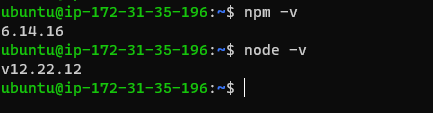
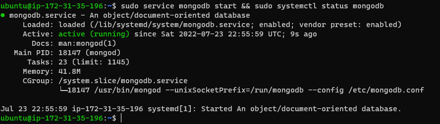
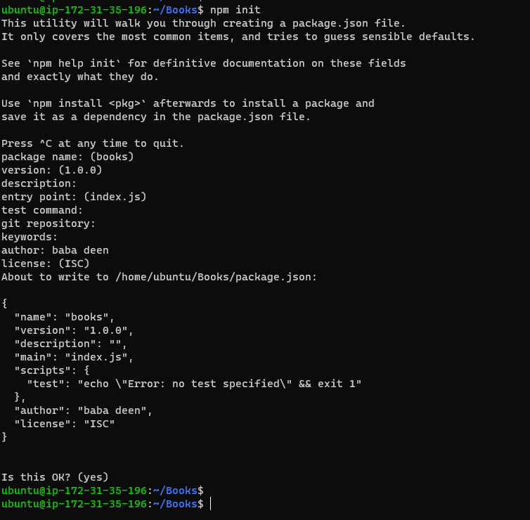
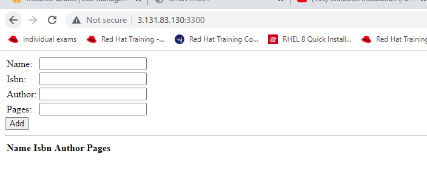

* Task --  implement a simple Book Register web form using MEAN stack. `

##  Step 1: first Update, upgrade ubuntu Instance created and add certs then Install NodeJs` 

` sudo apt update && sudo apt upgrade -y ` 

` sudo apt -y install curl dirmngr apt-transport-https lsb-release ca-certificates `

` curl -sL https://deb.nodesource.com/setup_12.x | sudo -E bash - `

` sudo apt install -y nodejs  -->> This installs both nodejs and npm ` 

* version of nodejs and npm is shown below `

##  Step 2: Installing MongoDB and adding book records to MongoDB that contain book name, isbn number, author, and number of pages. mages/WebConsole.gif 

` sudo apt-key adv --keyserver hkp://keyserver.ubuntu.com:80 --recv 0C49F3730359A14518585931BC711F9BA15703C6 `

` echo "deb [ arch=amd64 ] https://repo.mongodb.org/apt/ubuntu trusty/mongodb-org/3.4 multiverse" | sudo tee /etc/apt/sources.list.d/mongodb-org-3.4.list `

` sudo apt install -y mongodb `

* Start The server and Verify that the service is up and running `

` sudo service mongodb start && sudo systemctl status mongodb ` 

*  Install body-parser package `

` sudo npm install body-parser ` 

* Create a folder named ‘Books’ change into Books and in the Books directory, Initialize npm project ` 

` mkdir Books && cd Books ` 

` npm init `

* Add a file to Books dir named server.js, and paste the web server code below into the server.js file `

` vi server.js `

` var express = require('express');
var bodyParser = require('body-parser');
var app = express();
app.use(express.static(__dirname + '/public'));
app.use(bodyParser.json());
require('./apps/routes')(app);
app.set('port', 3300);
app.listen(app.get('port'), function() {
    console.log('Server up: http://localhost:' + app.get('port'));
}); `

##  Step 3: Install Express and set up routes to the server `

` sudo npm install express mongoose ` 

*  In ‘Books’ dir, create a dir named apps and create a file named routes.js and paste the below ` 

` mkdir apps && cd apps && vi routes.js `

`  var Book = require('./models/book');
module.exports = function(app) {
  app.get('/book', function(req, res) {
    Book.find({}, function(err, result) {
      if ( err ) throw err;
      res.json(result);
    });
  }); 
  app.post('/book', function(req, res) {
    var book = new Book( {
      name:req.body.name,
      isbn:req.body.isbn,
      author:req.body.author,
      pages:req.body.pages
    });
    book.save(function(err, result) {
      if ( err ) throw err;
      res.json( {
        message:"Successfully added book",
        book:result
      });
    });
  });
  app.delete("/book/:isbn", function(req, res) {
    Book.findOneAndRemove(req.query, function(err, result) {
      if ( err ) throw err;
      res.json( {
        message: "Successfully deleted the book",
        book: result
      });
    });
  });
  var path = require('path');
  app.get('*', function(req, res) {
    res.sendfile(path.join(__dirname + '/public', 'index.html'));
  });
}; `

* In ‘apps’ dir, create a dir named models and create a file named book.js and paste the below ` 

` mkdir models && cd models && vi books.js `

` var mongoose = require('mongoose');
var dbHost = 'mongodb://localhost:27017/test';
mongoose.connect(dbHost);
mongoose.connection;
mongoose.set('debug', true);
var bookSchema = mongoose.Schema( {
  name: String,
  isbn: {type: String, index: true},
  author: String,
  pages: Number
});
var Book = mongoose.model('Book', bookSchema);
module.exports = mongoose.model('Book', bookSchema); `

# Step 4 – Access the routes with AngularJS `

* change dir to "Books", create a dir public, cd into public and create a file name script.js and paste the below `  

` mkdir public && cd public && vi script.js `

` var app = angular.module('myApp', []);
app.controller('myCtrl', function($scope, $http) {
  $http( {
    method: 'GET',
    url: '/book'
  }).then(function successCallback(response) {
    $scope.books = response.data;
  }, function errorCallback(response) {
    console.log('Error: ' + response);
  });
  $scope.del_book = function(book) {
    $http( {
      method: 'DELETE',
      url: '/book/:isbn',
      params: {'isbn': book.isbn}
    }).then(function successCallback(response) {
      console.log(response);
    }, function errorCallback(response) {
      console.log('Error: ' + response);
    });
  };
  $scope.add_book = function() {
    var body = '{ "name": "' + $scope.Name + 
    '", "isbn": "' + $scope.Isbn +
    '", "author": "' + $scope.Author + 
    '", "pages": "' + $scope.Pages + '" }';
    $http({
      method: 'POST',
      url: '/book',
      data: body
    }).then(function successCallback(response) {
      console.log(response);
    }, function errorCallback(response) {
      console.log('Error: ' + response);
    });
  };
}); `

* in public dir, create a file named index.html  and paste the below `

` vi index.html `

` <!doctype html>
<html ng-app="myApp" ng-controller="myCtrl">
  <head>
    
    
  </head>
  <body>
    

      <table>
        <tr>
          <td>Name:</td>
          <td><input type="text" ng-model="Name"></td>
        </tr>
        <tr>
          <td>Isbn:</td>
          <td><input type="text" ng-model="Isbn"></td>
        </tr>
        <tr>
          <td>Author:</td>
          <td><input type="text" ng-model="Author"></td>
        </tr>
        <tr>
          <td>Pages:</td>
          <td><input type="number" ng-model="Pages"></td>
        </tr>
      </table>
      <button ng-click="add_book()">Add</button>
    

    

    

      <table>
        <tr>
          <th>Name</th>
          <th>Isbn</th>
          <th>Author</th>
          <th>Pages</th>

        </tr>
        <tr ng-repeat="book in books">
          <td>{{book.name}}</td>
          <td>{{book.isbn}}</td>
          <td>{{book.author}}</td>
          <td>{{book.pages}}</td>

          <td><input type="button" value="Delete" data-ng-click="del_book(book)"></td>
        </tr>
      </table>
    

  </body>
</html>
` 

*  change dir back to "Books" and Start the server by running the command below `

` node server.js ` 

` # once the server is now up and running, we can connect it via port 3300. You can launch a seperate SSH console to test what curl command returns locally.  please open up port 3300 on the EC2 instance ` 

` curl -s http://localhost:3300  >>> this will allow us to access the Book register web app from the internet` 

